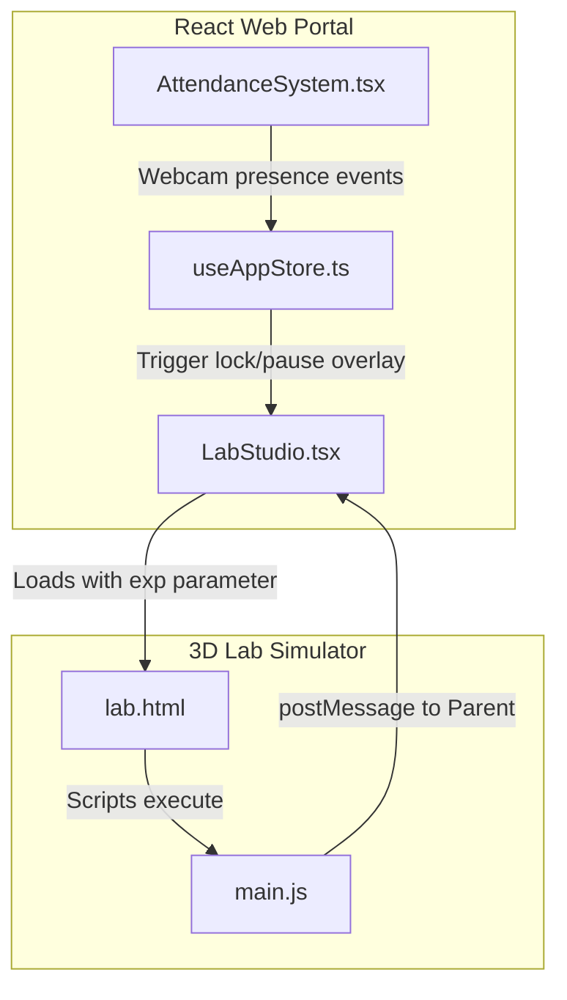

# ⚛️ Circuit.IQ — React Website Portal

> The main website — landing page, experiment catalog, AI chat, and 3D lab launcher.

---

## What This Does

This is the **front door** of Circuit.IQ. Students visit this website to:

- 🏠 Browse the **experiment catalog** (26 experiments across 4 physics domains)
- 🔬 **Launch the 3D lab** for any experiment
- 🤖 Chat with the **AI PhysicsBot** to ask questions
- 📞 Submit **support tickets** via the contact page
- 🎓 Track **attendance** records

The 3D lab simulator is loaded as an **iframe** inside this website.

---

## 🚀 How to Run

### With the full app (recommended):
```bash
# From project root:
python start_dev.py    # Starts backend + this website
```

### Standalone:
```bash
cd LABfront-IQ-Portal
npm install
npm run dev            # → http://localhost:3000
```

> **Note:** API features (AI, saving, physics) need the Flask backend running on port 5000.

---

## 📁 File Guide

```
LABfront-IQ-Portal/
├── index.html                     ← Root HTML template
├── package.json                   ← Dependencies
├── vite.config.ts                 ← Build config + API proxy → :5000
├── tsconfig.json                  ← TypeScript settings
│
├── src/
│   ├── main.tsx                   ← React entry point
│   ├── App.tsx                    ← Page router (landing / lab / contact)
│   ├── index.css                  ← Global styles + Tailwind
│   │
│   ├── store/
│   │   └── useAppStore.ts         ← Global state (Zustand)
│   │                                 • Which page is active
│   │                                 • Which experiment is selected
│   │                                 • Whether the lab is open
│   │
│   ├── pages/
│   │   ├── LandingPage.tsx        ← 🏠 Homepage
│   │   │                              Hero animation, experiment catalog,
│   │   │                              AI console, team section
│   │   ├── LabStudio.tsx          ← 🔬 3D Lab Launcher
│   │   │                              Loads /lab.html?exp=<key> in iframe
│   │   └── ContactPage.tsx        ← 📞 Support form + FAQ
│   │
│   └── components/
│       ├── Navbar.tsx             ← Navigation bar
│       ├── AntigravityHero.tsx    ← 3D floating components (hero section)
│       ├── PhysicsBotPanel.tsx    ← AI chat terminal
│       ├── PhysicsShowcase.tsx    ← Interactive demo widgets
│       ├── InteractiveCircuitLines.tsx  ← Animated background
│       ├── InteractiveBreadboard.tsx    ← 2D breadboard visual
│       ├── CyberpunkLedMatrix.tsx      ← LED matrix effect
│       ├── AttendanceSystem.tsx   ← Student attendance tracker
│       └── TeamRolesSection.tsx   ← Team member cards
│
└── public/
    ├── lab.html                   ← Built 3D lab (from build_all.py)
    └── assets/                    ← Built lab JS/CSS bundles
```

---

## 📄 Pages

### 🏠 LandingPage

The homepage has these sections:

| Section | What it shows |
|---------|-------------|
| **Hero** | Animated 3D floating electronic components |
| **Experiment Catalog** | 4 domains, 26 experiments — click to launch lab |
| **PhysicsBot** | Terminal-style AI chat for physics Q&A |
| **Showcases** | Interactive mini-demos (breadboard, oscilloscope, LED matrix) |
| **Team** | Founder profiles with role descriptions |

### 🔬 LabStudio

- Renders the 3D lab simulator in a **fullscreen iframe**
- URL: `/lab.html?exp=ohms` (experiment key passed via URL)
- Handles WebGL context cleanup when navigating away

### 📞 ContactPage

- Support ticket form with premium spring-loaded entrance animations, card lifts on hover, responsive button scales, and FAQ transitions
- Sends via `/api/contact` to email
- FAQ accordion section

---

## 🧩 Key Components

| Component | What it does |
|-----------|-------------|
| `Navbar` | Top navigation — links to Home, Experiments, Lab, Contact |
| `AntigravityHero` | 3D scene with floating resistors/capacitors (React Three Fiber) |
| `PhysicsBotPanel` | Upgraded slate glass chat interface with custom avatars, suggestions chips, and pulsing waves |
| `PhysicsShowcase` | Animated mini-demos on the homepage |
| `AttendanceSystem` | Student attendance tracking table |
| `TeamRolesSection` | Founder cards with waveform visualizations |

---

## 📦 State Management

Uses **Zustand** — a simple global state store:

```typescript
// What's in the store:
currentPage: 'landing' | 'lab' | 'contact'   // Which page to show
currentExperiment: 'ohms'                      // Selected experiment
isLabOpen: boolean                             // Is the lab iframe visible?

// How to use it:
const { openLab } = useAppStore();
openLab('ohms');    // Opens the lab with Ohm's Law
```

---

## 🔬 How the 3D Lab Loads

```
Student clicks "Launch Lab" on experiment card
    → useAppStore.openLab('ohms')
    → LabStudio renders <iframe src="/lab.html?exp=ohms" />
    → 3D lab reads ?exp=ohms from URL
    → Initializes the Ohm's Law experiment
    → Lab talks to Flask backend independently via /api/*
```

---

## 🛠️ Tech Stack

| Tool | Version | What it does |
|------|---------|-------------|
| React | 19 | UI framework |
| TypeScript | 5.8 | Type checking |
| Vite | 6.2 | Build tool + dev server |
| TailwindCSS | 4.1 | Styling |
| Zustand | 5.0 | State management |
| Three.js | 0.184 | Hero animation |
| React Three Fiber | 9.6 | React + Three.js bridge |
| GSAP | 3.15 | Animations |
| Lucide | 0.546 | Icons |
| Motion | 12.23 | Animation library |

---

## 🎨 Theme System & Color Adaptability

The Portal integrates a dynamic theme synchronization framework managed via Zustand (`useAppStore.ts`):
- **Default Theme state**: Configured to load `'dark'` mode by default on initial application launch.
- **Root Class Overrides**: Toggling the theme adds or removes the `.dark` utility class from `document.documentElement`, altering page colors across the landing page, showcases, contact sections, and footers.
- **Dynamic Background Canvas**: The Experiments catalog uses an interactive canvas background (`CyberCircuitBackground.tsx`) which evaluates theme changes on-the-fly, swapping particle grid networks between deep space-dark and clean light-slate styling.
- **Iframe Synchronization**: Selecting a new theme broadcasts a postMessage handshake down to the embedded WebGL canvas iframe, synchronously updating scene fog, PCB plate reflections, and meter readings.

---

## 🏗️ Building

```bash
npm run dev        # Development server (hot reload)
npm run build      # Production build → dist/
npm run preview    # Preview production build
npm run lint       # TypeScript type check
```

Or build everything at once from project root:
```bash
python build_all.py
```


---

## 🔌 Connection & Component Interaction Flow

The frontend portal works in close coordination with the embedded 3D simulation iframe:



### 1. Unified State Flow (Zustand & iframe)
- When the student triggers an experiment in the catalog, `useAppStore` updates the `currentExperiment` value and opens the simulator modal layout inside `LabStudio.tsx`.
- `LabStudio.tsx` loads the static shell `/lab.html?exp=<key>`. Inside the iframe, `main.js` reads the query string and loads the configuration parameters and step-tracker guidelines for that specific experiment.

### 2. Parameter Sync & Physics Engine Communication
- Adjusting sliders (voltage, resistance, frequency) on the right panel registers changes to `state.params` inside the simulator.
- The simulator makes asynchronous `POST` requests to `/api/calculate` with parameters. The backend physics engine resolves the math (current, power, phase shift, etc.) and returns the values.
- These computed values update the virtual multimeter dials, dual-channel oscilloscope canvas, and the V-I plot graph in real-time.

### 3. Student Progress Auto-Saving & Restoration
- Every time a component is dropped onto the breadboard or a wire connection is completed/deleted, a debounced call is sent to `/api/db/save-circuit` to backup the layout JSON.
- If a student leaves the page and returns, the simulator queries `/api/db/load-circuit`. Upon finding a previous save, the portal prompts the user to restore their progress or start fresh.

### 4. Webcam Attendance & Presence Safety Safeguard
- The webcam uses TensorFlow.js to scan the area in front of the browser.
- If the number of detected students drops below the expected group threshold, `AttendanceSystem.tsx` calls `onLabPause()` which sets `isLabOpen = false` or triggers a modal lock screen.
- This posts a `paused` state to `/api/session/<id>/presence` and signals the iframe to halt the active simulation clock.

---

## ❓ Common Problems


| Problem | Fix |
|---------|-----|
| Blank page | Check `npm run build` output for errors |
| API calls fail | Make sure Flask backend is running on port 5000 |
| 3D hero not showing | Check browser WebGL support (console for errors) |
| Lab iframe is blank | Run `python build_all.py` to create `public/lab.html` |
| Styles missing | Ensure TailwindCSS plugin is in `vite.config.ts` |
