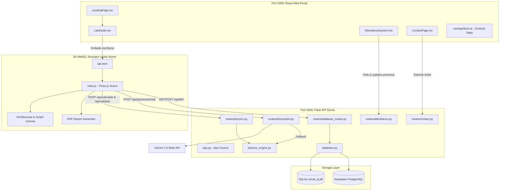
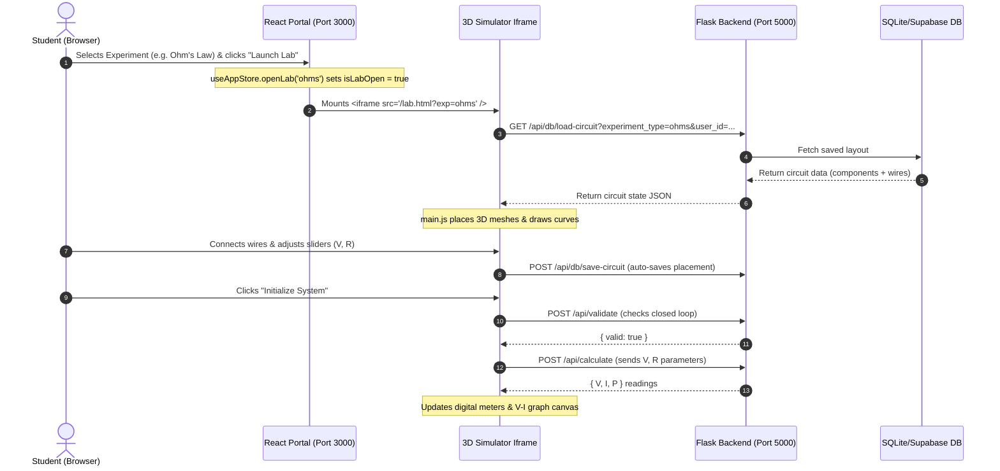

<div align="center">

# ⚡ Circuit.IQ

### AI-Powered 3D Virtual Physics Laboratory

A premium, full-stack 3D physics simulation platform where students construct circuits on virtual breadboards, perform real-time measurements, and receive AI-guided tutoring — all inside a modern, glassmorphic browser portal.

[](#-backend-server-python-flask)
[](#-backend-server-python-flask)
[](#-react-portal)
[](#-3d-simulator-threejs)
[](#-database-sync--persistence)

</div>

---

## 📖 Navigation & Quick Links
*   [🛠️ System Architecture & Data Flow](#-system-architecture--data-flow)
*   [🔗 Connection & Communication Architecture](#-connection--communication-architecture)
*   [🌟 Key Features](#-key-features)
*   [👥 Live Attendance & Security System](#-live-attendance--security-system)
*   [🤖 Global PhysicsBot AI Console](#-global-physicsbot-ai-console)
*   [💾 Database Sync & Persistence](#-database-sync--persistence)
*   [🔌 All API Endpoints Reference](#-all-api-endpoints-reference)
*   [📁 Project Directory & Component Map](#-project-directory--component-map)
*   [🚀 Installation & Development Quickstart](#-installation--development-quickstart)
*   [🎨 Design System & Visuals](#-design-system--visuals)
*   [🔬 List of 26 Simulator Experiments](#-list-of-26-simulator-experiments)
*   [🛠️ Performance & Troubleshooting](#-performance--troubleshooting)

---

## 🛠️ System Architecture & Data Flow

Circuit.IQ is designed with a decoupled but highly integrated three-tier architecture:
1.  **Core Web Portal (React 19)**: Manages authentication, profile settings, the interactive experiment catalog, global AI chatbot queries, contact tickets, and the classroom attendance system.
2.  **3D Breadboard Simulator (Three.js)**: Runs in a dedicated WebGL scene inside a same-origin `iframe`. It handles the drag-and-drop workspace, physical wiring connections, visual electron flow animations, oscilloscope waveforms, and observation charts.
3.  **Python Flask Backend**: Handles rigorous calculations (voltage, current, impedance, transient time constants, calorimetry, and radioactivity), persists user save states, routes student questions to Gemini AI, generates diagnostic audit logs, and sends notification emails via Resend.

### 🌐 Architectural Flowchart


### 🔄 End-to-End Simulation Sequence
This sequence demonstrates the loading, circuit construction, backend verification, real-time math execution, and log saving flow:


---

## 🔗 Connection & Communication Architecture

*   **Same-Origin Iframe Embedding**: The React website wrapper ([LabStudio.tsx](file:///c:/Users/anaya/OneDrive/Desktop/working%20folder%20new/Circuit.IQ/LABfront-IQ-Portal/src/pages/LabStudio.tsx)) loads `lab.html` in an iframe. Since the Flask server hosts the static bundle on the same port in production (and dev mode uses Vite proxies), they share cookies, session tokens, and local storage seamlessly.
*   **Parameter Synchronization**: When the student moves a slider in the simulator control panel, the changes are captured locally in `state.params` and dispatched to `/api/calculate`. The backend calculates the resulting electrical states, returning current, impedance, phase angles, and energy values. These are immediately written to the digital meters and recorded in `state.dataPoints` for graph plotting.
*   **Automatic Backup (Auto-Save)**: Every placement of a component or drawing of a wire triggers a background asynchronous POST request to `/api/db/save-circuit`. If the student refreshes or crashes, the simulator queries `/api/db/load-circuit` and reconstructs the scene automatically.
*   **Fidelity Lock (Wire Restoration)**: 
    *   *Manual user drawing*: Wires snap to closest holes automatically: `create3DWire(start, end, true)`.
    *   *Database reloading*: Restores positions exactly without snapping adjustments: `create3DWire(from, to, false)`. This keeps components and wires in their exact custom layout locations.

---

## 🌟 Key Features

*   **26 Physics Modules**: Covering breadboard circuits, semiconductors, visual electromagnetism simulators, ideal gases, calorimetry, stopping voltages, orbital shells, and radioactive half-lives.
*   **Photorealistic 3D Breadboard Workspace**: Interactive Three.js scene supporting orbital rotations, component dragging, and Bézier wire drawing.
*   **Context-Aware AI Mentor**: Panel-based chatbot inside the simulator ([PhysicsBotPanel.tsx](file:///c:/Users/anaya/OneDrive/Desktop/working%20folder%20new/Circuit.IQ/LABfront-IQ-Portal/src/components/PhysicsBotPanel.tsx)) redesigned with premium glassmorphic visual aesthetics, distinct message bubbles (gradient user bubbles vs. outlined bot bubbles), glowing round avatars, horizontal scrollable quick prompt chips, and a bouncing-wave typing indicator. The AI reads the current layout structure, slider values, and meter readouts to guide students through faults.
*   **Global PhysicsBot Chat Console**: Homepage terminal simulator equipped with quick-command shortcuts (`ohms-solver`, `lcr-resonance`) that matches, explains, and loads target simulations with a single click.
*   **Integrated Telemetry Instruments**: Active virtual digital multimeters, a functional dual-channel oscilloscope, and live data plotting canvas graphs.
*   **Printable Academic Lab Reports**: Dynamically prints professional PDF reports compiling the student's name, university, aim, apparatus, theory formulas, observation tables, graded viva voce questions, and conclusion text.
*   **Dual-Database Adapter Engine**: Fluid database synchronization using a local SQLite driver (`circuit_iq.db`) as a default fallback and cloud Supabase (PostgreSQL) when environment keys are active.
*   **Classroom Security & Presence Lock**: Client-side TensorFlow.js camera monitoring loop checking student presence to automatically lock the lab and pause ongoing simulations.

---

## 🚀 Virtual Lab Optimization & KVL Refinement

A series of core architectural and visual optimizations have been integrated to elevate the simulation to professional standards:

### 1. Smart Snapping & Expected Tool Matching
- **Expected Tool Lock**: A helper `getCurrentExpectedTool()` analyzes the active experiment state and dynamically limits drag-and-drop or click placements to only match the expected component/wire type for the active step.
- **Ghost Preview Snapping**: In `dragover` events, if a valid expected tool is hovered, the simulator automatically overrides position snapping coordinates with target snap coordinates (`snap1`/`snap2`), causing the semi-transparent ghost mesh to snap instantly into place.
- **Floating Coordinate Projections**: Guide pins **A** and **B** are projected dynamically from 3D target coordinates (`targetHighlightRing1`/`targetHighlightRing2`) to 2D HTML overlay elements using vector projection (`Vector3.project(camera)`) and responsive pixel offsets, keeping instructions perfectly readable above the target breadboard holes.
- **Frustum Culling**: Projected guide pins automatically hide when they go behind the camera plane (`z > 1`) to prevent floating UI artifacts.

### 2. Responsive Theme Synchronization & Default Dark Mode
- **Bi-Directional PostMessage Bridge**: Theme toggles sync seamlessly between the React Portal context and the embedded 3D Lab simulation iframe via message passing. 
- **Dynamic CSS Variables & Fog Overrides**: Updating themes modifies root document classes (`.light-theme`), inverting UI panels, sliders, grids, multimeters, and WebGL clear backgrounds (`scene.background` and exponential fog) on-the-fly without requiring context reloads.
- **Default Dark Mode**: The entire platform defaults to Dark Mode initially to maintain the premium tech theme.

### 3. Upgraded Eraser Wire Collision
- The eraser tool now evaluates intersections not just with the core thin wire tubes, but also with wire terminal pins and plastic sleeves. Clicking any part of a wire will instantly delete it, resolving the previous precision click issues.

### 4. Professional KVL Experiment Refinement
- **Sequential Measurements**: Real-time probing of KVL voltages tracks the student's progress as they measure $V_s$ (Source rails), $V_1$ (Resistor 1), and $V_2$ (Resistor 2).
- **Live Math Telemetry**: Built-in math parsing checks the loop voltage drop calculation ($V_s - V_1 - V_2 = 0$) and displays formulas, active probe states, current, and equivalent resistance inside a dedicated, real-time telemetry card.
- **Orientation-Agnostic Guiding Highlights**: The visual target highlights dynamically adjust depending on which probe the student connects first. Connecting either probe to one target will automatically guide the remaining free probe to the other counterpart terminal, supporting any polarity/connection order natively.

---


## 👥 Live Attendance & Security System

Circuit.IQ includes a professional, classroom-grade attendance and presence verification system designed to help professors monitor group lab sessions and prevent unattended simulations.

### System Workflow
1.  **Professor Session Creation**:
    *   Professors log in to the admin dashboard using `ADMIN_PASSWORD` (default: `circuitiq@admin2025`).
    *   They select the target experiment, group name, expected group size, and input the authorized registration numbers.
    *   The backend creates a session code (e.g. `A3F92B1C`) and tracks check-in events in-memory.
2.  **Student Check-in**:
    *   Students enter the classroom session code and their registration number.
    *   The portal checks if they are authorized and logs them into a queue.
    *   When all registered members are checked in, the session activates.
3.  **Computer Vision Presence Verification**:
    *   The student's webcam begins scanning and loads the pre-trained object-detection model **TensorFlow.js (COCO-SSD)** from a secure CDN.
    *   A local detection loop runs every 1.5 seconds, counting the number of individuals present in the frame.
    *   **Sim Safety Safeguard**: If any student leaves the camera frame (count drops below the registered group threshold), the portal triggers `onLabPause()`. This immediately locks the 3D lab controls, pauses the simulation, and posts a `paused` status to `/api/session/<id>/presence`. When the student returns, the simulation resumes.
4.  **Audit Trail Logging**:
    *   The system records every checkpoint: check-in timestamps, camera presence drops, pause/resume timeline events, and final grades.
    *   Professors can monitor live status logs, end the session, and export a clean `.txt` log file for grading.

---

## 🤖 Global PhysicsBot AI Console

The homepage features a terminal-style chatbot interface dedicated to general physics tutoring, now upgraded with a premium glassmorphic dark interface:
*   **Redesigned Visual System**: Integrated with glowing status badges, custom animated user/bot avatars, visual bubble separation, and automated timestamps.
*   **Structured Queries**: Calls the `/api/physics-bot` endpoint to retrieve concise explanations, formulas, and recommended simulation modules.
*   **Quick Suggestion Chips**: Students can click pre-set command/prompt chips (like `ohms-solver`, `lcr-resonance`, `ideal-gas`, and `photoelectric-effect`) to instantly run common queries or auto-fill custom questions.
*   **Interactive Simulation Launch**: If a query is related to one of the simulator experiments, the AI provides an action button to automatically load and launch that simulation inside the virtual lab.
*   **Bouncing typing indicator**: Beautiful multi-colored bouncing dots wave animation showing search status.
*   **Offline Keyword Parser**: If `GEMINI_API_KEY` is not set, a local keyword parser evaluates questions (matching words like "ohm", "lcr", "pendulum", "snell", "gas") and responds with structured formulas and local instructions.

---

## 💾 Database Sync & Persistence

The backend uses a dual database adapter structure ([database.py](file:///c:/Users/anaya/OneDrive/Desktop/working%20folder%20new/Circuit.IQ/LABback-IQ/database.py)) for automatic environment compatibility:
*   **Local SQLite Driver**: Saves data to `circuit_iq.db` automatically if Supabase variables are absent.
*   **Seeded Sandbox**: Initializes a default profile for student `Aisha Rahman` (ID: `a1b2c3d4-e5f6-7890-abcd-ef1234567890`) and pre-configures a sample Ohm's Law circuit so the simulator is functional on fresh deployments.
*   **PostgreSQL Migration**: The database script files ([schema.sql](file:///c:/Users/anaya/OneDrive/Desktop/working%20folder%20new/Circuit.IQ/LABdata-IQ/schema.sql)) and ([customise.sql](file:///c:/Users/anaya/OneDrive/Desktop/working%20folder%20new/Circuit.IQ/LABdata-IQ/customise.sql)) define matching schemas, constraints, trigger functions for updated timestamps, Row Level Security (RLS) policies, and test data seeding for deployment on Supabase.

### 💾 Save & Restore Progress Workflow
Circuit.IQ features a student progress saving mechanism designed for long or multi-stage experiments:
1.  **Auto-Save Sync**: The 3D simulator triggers a debounced layout backup (`debouncedSaveCircuit()`) to the Flask database route `/api/db/save-circuit` on every component placement or wire connection, showing `DB: SYNCING...` then `DB: SAVED` on the status bar.
2.  **Manual Save Progress Button**: A dedicated **Save Progress** button with a floppy disk icon in the lab's topbar allows students to manually sync their workspace configuration to the cloud/local database immediately. On success, a glowing, semi-transparent toast notification appears on the screen: *"Progress saved successfully!"*.
3.  **Restore Prompt on Load**: When launching an experiment (on initial load, selection change, or from the library list), the system queries `/api/db/load-circuit`. If a previous saved layout is discovered, it suspends loading and opens an overlay confirmation modal asking: *"Saved Progress Found: Would you like to restore your saved layout or start a fresh experiment?"*.
    *   **Restore Progress**: Clears the workspace and reconstructs the saved component locations, parameter knobs, and wire links (restored exactly without snapping offsets). The status bar updates to `DB: LOADED`.
    *   **Start From New**: Resets the database records for this experiment to an empty state immediately by saving a blank layout, allowing the student to work on a fresh breadboard.

---

## 🔌 All API Endpoints Reference

### 🧮 Physics & Calculations
*   `POST /api/validate`: Validates circuit wiring using a union-find connection search algorithm.
*   `POST /api/calculate`: Computes metrics (V, I, Z, P, phase angle, resonance) for the active experiment.

### 🤖 AI PhysicsBot
*   `POST /api/physicsbot/ask`: Receives user question + circuit state, and prompts Gemini 2.5-flash for context-aware lab help.
*   `POST /api/physics-bot`: Receives general physics questions on the homepage and returns explanations, formulas, and recommended simulation keys.

### 💾 Storage & Logs
*   `POST /api/db/save-circuit`: Saves active components, wire connections, and slider parameters.
*   `GET /api/db/load-circuit`: Fetches saved layout JSON for an experiment (queries: `user_id`, `experiment_type`).
*   `POST /api/db/save-log`: Saves experiment completion metrics, grades, and notes.
*   `GET /api/db/get-logs`: Retrieves past lab logs for auditing (queries: `user_id`, `experiment_type`).
*   `GET /api/db/profile`: Fetches student profile data.
*   `POST /api/db/profile`: Creates or updates student metadata.

### 🎓 Classroom Attendance
*   `POST /api/admin/login`: Verifies admin password and issues session token.
*   `POST /api/admin/session/create`: Spawns a tracking session with student numbers.
*   `GET /api/admin/session/list`: Lists all sessions.
*   `DELETE /api/admin/session/<id>/delete`: Removes a session.
*   `POST /api/session/join`: Student check-in via join code.
*   `GET /api/session/<id>/status`: Polls status (waiting, active, paused, ended).
*   `POST /api/session/<id>/presence`: Updates camera detection counts.
*   `POST /api/session/<id>/end`: Concludes session and compiles logs.
*   `GET /api/session/<id>/log`: Downloads audit logs.

### 📞 Support & Feedback
*   `POST /api/contact`: Submits support tickets and emails them via Resend API.

---

## 📁 Project Directory & Component Map

Below is a map of the repository's directories and primary source files:

```
Circuit.IQ/
├── start_dev.py                # Starts Flask and React Dev servers concurrently
├── build_all.py                # Production build pipeline compiler
├── LABdata-IQ/                 # 💾 DATABASE SCHEMAS & MIGRATIONS
│   ├── schema.sql              #   PostgreSQL core table schemas (Supabase)
│   └── customise.sql           #   DB extension columns and migration queries
├── circuit_iq.db               # Auto-created local SQLite database file
│
├── LABback-IQ/                 # 🐍 PYTHON FLASK BACKEND SERVER
│   ├── main.py                 # Backend entrypoint (runs create_app())
│   ├── app.py                  # Flask configuration, blueprints, CORS, and static routes
│   ├── config.py               # Reads environment keys from .env
│   ├── database.py             # Database wrapper (SQLite/Supabase sync layer)
│   ├── physics_engine.py       # Physics calculations for DC, AC, and visual simulators
│   ├── ai_guide.py             # Offline guidance steps, formulas, and viva questions
│   ├── test_physics.py         # Unit tests for verification
│   └── routes/                 # Flask route controllers
│       ├── physics.py          #   /api/validate and /api/calculate
│       ├── physicsbot.py       #   /api/physicsbot/ask and /api/physics-bot
│       ├── database_routes.py  #   /api/db/* save, load, profile, and logs
│       ├── attendance.py       #   /api/admin/* and /api/session/* attendance
│       └── contact.py          #   /api/contact support ticketing
│
├── LABfront-IQ-3D/             # ⚡ 3D SIMULATOR (THREE.JS ENGINE)
│   ├── index.html              # Simulation structure, meters, graph overlay, and panels
│   ├── src/main.js             # 3D Breadboard, drag-drop, curves, graph, and PDF report
│   ├── src/style.css           # Glassmorphic panels, neon dark-theme styles
│   └── public/models/          # GLTF 3D components (resistors, switches, diodes)
│
└── LABfront-IQ-Portal/        # ⚛️ REACT WEB PORTAL
    ├── src/main.tsx            # React application entrypoint
    ├── src/App.tsx             # SPA route navigator
    ├── src/index.css           # Global typography, glassmorphism, and Tailwind
    ├── src/store/
    │   └── useAppStore.ts      # Zustand global state (lab view, experiment selected)
    ├── src/pages/              # Main view files
    │   ├── LandingPage.tsx     #   Hero scene, experiment catalog, and AI chatbot console
    │   ├── LabStudio.tsx       #   Fullscreen simulator iframe container
    │   └── ContactPage.tsx     #   Support submission form and diagnostics FAQ
    └── src/components/         # Modular interactive widgets
        ├── Navbar.tsx          #   Sleek navigation controls
        ├── AntigravityHero.tsx #   3D floating components animation (Three.js/Fiber)
        ├── PhysicsBotPanel.tsx #   Lab chat sidebar connector
        ├── AttendanceSystem.tsx#   Professor/Student live monitor and TensorFlow controller
        ├── CyberpunkLedMatrix.tsx # LED grid animation
        └── TeamRolesSection.tsx#   Founders showcase cards
```

---

## 🚀 Installation & Development Quickstart

Ensure you have [Node.js (v18+)](https://nodejs.org/) and [Python (v3.8+)](https://www.python.org/) installed.

### 1. Install Dependencies
```bash
# Clone the repository
git clone https://github.com/SYEDTUFAILANDRABI/Circuit.IQ.git
cd Circuit.IQ

# Install Python backend requirements
pip install -r LABback-IQ/requirements.txt

# Install 3D Lab Simulator packages
cd LABfront-IQ-3D && npm install && cd ..

# Install React Web Portal packages
cd LABfront-IQ-Portal && npm install && cd ..
```

### 2. Configure Environment Variables
Copy the backend environment variables template:
```bash
cp LABback-IQ/.env.example LABback-IQ/.env
```
Open `LABback-IQ/.env` and edit your parameters:
*   `GEMINI_API_KEY`: Set your Gemini key. If empty, the app runs on built-in offline guidance.
*   `SUPABASE_URL` / `SUPABASE_ANON_KEY`: Configures Supabase cloud database. If empty, local SQLite database (`circuit_iq.db`) is used.
*   `RESEND_API_KEY`: Connects Resend for emailing support tickets. If empty, logs to console.

### 3. Run in Development Mode
Start both development servers concurrently using our unified script:
```bash
python start_dev.py
```
This launches the Python Flask backend on port `5000` and the React frontend portal on port `3000`, automatically opening `http://localhost:3000` in your default browser.

### 4. Build for Production
To bundle the entire project into static files for deployment, run:
```bash
python build_all.py
```
This compiles the 3D WebGL simulator, copies the compiled assets to the React public directory, packages the React app into `dist/`, and prepares the Flask backend to host it directly.

Once built, you can run the production server:
```bash
cd LABback-IQ
python main.py
```
Open `http://localhost:5000` to access the final build.

---

## 🎨 Design System & Visuals

Circuit.IQ uses a premium dark aesthetic combined with modern typography:
*   **Palette**: Neon accents (Emerald green `#10b981`, Cyber blue `#3b82f6`, Dark void `#070b14`) styled with dynamic hover gradients.
*   **Typography**: Utilizes `Outfit` and `Inter` via Google Fonts.
*   **Glassmorphism**: UI panels are structured with light borders, backdrop blur properties (`backdrop-filter: blur(16px)`), and semi-transparent backgrounds.
*   **Animations**: Built using GSAP, Framer Motion, and Tailwind transitions. Includes spring-loaded card entry slide-ins, tactical hover lifts, button tap scales, and slow breathing background glow pulses on the Contact Page.

---

## 🔬 List of 26 Simulator Experiments

### ⚡ Electricity & Circuits
1.  **Ohm's Law Verification** – Find the linear relationship between voltage and current (`V = I × R`).
2.  **Kirchhoff's Voltage Law (KVL)** – Verify that loop voltages sum to zero (`ΣV = 0`).
3.  **Kirchhoff's Current Law (KCL)** – Prove that current entering a node equals current leaving it (`ΣI_in = ΣI_out`).
4.  **LCR AC Impedance** – Analyze impedance `Z` under AC currents (`Z = √[R² + (XL−XC)²]`).
5.  **Series LCR Resonance** – Find the frequency where inductive and capacitive reactances cancel (`f₀ = 1/(2π√LC)`).
6.  **RC Time Constant** – Observe capacitor transient response timings (`τ = R × C`).
7.  **Series & Parallel Loads** – Compare total resistance combinations.
8.  **Wheatstone Bridge** – Calculate an unknown resistor value at balance.

### 🔌 Semiconductor & Components
9.  **Diode I-V Characteristics** – Graph exponential diode forward and reverse bias behaviors.
10. **Voltage & Current Divider** – Study division ratios in series/parallel configurations.

### 🧲 Electromagnetism
12. **Faraday's Induction Law** – Induce voltage by moving a magnet through a coil.
13. **Lenz's Law Demonstration** – Observe how induced voltage polarity opposes change.
14. **Solenoid Magnetic Field** – Calculate field strength inside a coil (`B = μ₀nI`).
15. **AC Transformer Ratio** – Step-up or step-down voltage values using windings ratios.
16. **Biot-Savart's Law** – Plot magnetic field decay from a straight wire.

### ⚛️ Modern & Quantum Physics
17. **Planck's Constant (LEDs)** – Find `h` using colored LED turn-on threshold voltages.
18. **Planck's Constant (Photocell)** – Measure stopping potential of a vacuum photocell.
19. **Photoelectric Effect** – Observe electron ejection under varying light wavelengths.
20. **Radioactive Decay** – Watch parent nuclei decay exponentially (`N(t) = N₀e^(−λt)`).
21. **de Broglie Matter Wave** – Study wave-particle duality wavelengths (`λ = h/p`).
22. **Bohr Hydrogen Atom** – Simulate Discrete orbital shells and spectral emissions.

### 🔥 Thermodynamics
23. **Stefan-Boltzmann Law** – Verify radiated energy scales with temperature (`P = σϵAT⁴`).
24. **Ideal Gas Equation** – Interlink state variables (`PV = nRT`).
25. **Boyle's Law** – Plot volume contraction under scaling pressures (`P₁V₁ = P₂V₂`).
26. **Charles's Law** – Observe gas expansion under thermal heating (`V₁/T₁ = V₂/T₂`).

---

## 🛠️ Performance & Troubleshooting

### Bundle Size & Dynamic Code Splitting
*   **Lazy Loading Heavy Assets**: The core WebGL Three.js elements (`AntigravityHero.tsx` and `CyberpunkLedMatrix.tsx`) utilize heavy libraries (`three`, `@react-three/fiber`, `@react-three/drei`, `@react-three/postprocessing`).
*   **Vite Chunk Splitting**: To minimize the initial JavaScript entry bundle size (~1.75 MB reduced to light portal files), these components are dynamically loaded using `React.lazy` and wrapped in React `Suspense` containers.
*   **Premium Fallback Skeletons**: Fallbacks prevent layouts from shifting during load by rendering high-fidelity dark skeleton frames with animated neon spinners.

### Scroll Animation Synchronization (Lenis & GSAP)
*   **Ticker Connection**: To prevent visual stuttering and guarantee that scroll-scrubbed GSAP animations (such as the 3D breadboard assembly and text fades) trigger continuously and smoothly on both scroll-up and scroll-down, the `Lenis` smooth-scroller is connected directly to `ScrollTrigger.update` and ticked via the global GSAP ticker.
*   **Cleanup & Memory Management**: Ticker updates and Lenis events are automatically removed during component unmounting to prevent memory leaks.

### WebGL Context Management (Leaks Resolved)
*   **Chrome Limits**: Chrome limits active WebGL contexts per browser session. Frequent iframe reloads can lead to a `WebGL Context Lost` crash.
*   **Automatic Cleanups**: Circuit.IQ includes unmount hooks inside `LabStudio.tsx` and window `unload` events in `main.js` that invoke `loseContext()` and `renderer.dispose()` automatically when leaving the lab, preventing memory leaks.
*   **Post-Processing Control**: If you experience low frame rates, toggle **High Fidelity Mode** in the settings panel to disable post-processing bloom.

### General Diagnostic Fixes
*   *Module Errors*: Run `pip install -r requirements.txt` and `npm install` in corresponding directories.
*   *Port Conflicts*: If port 5000 or 3000 is occupied, set a custom port in `LABback-IQ/.env` or terminate the conflicting process.
*   *PDF Pop-ups*: Ensure your browser is configured to allow pop-ups for `localhost` to download reports.
*   *Wire Snapping Glitches*: If wires jump incorrectly on load, verify the database loads them using `false` (skipping snapping adjustments).

---

<div align="center">

**Circuit.IQ Development Team**  
*Interactive Virtual Physics Laboratories for Modern Science & Engineering*

</div>
