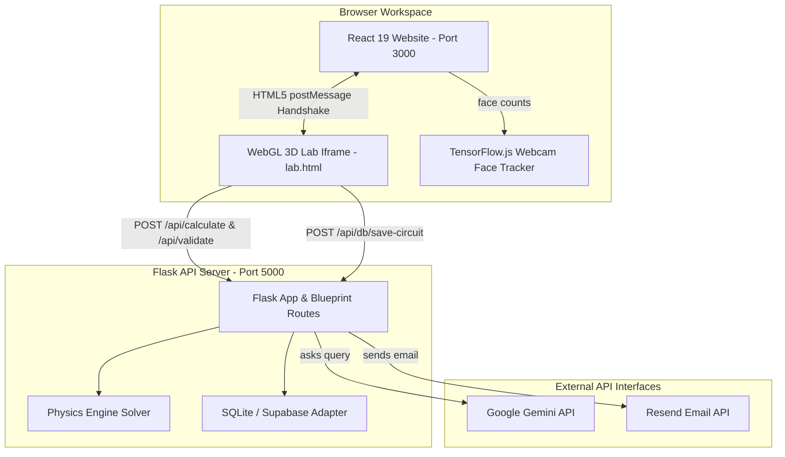

# ⚡ Circuit.IQ — Ultimate Full-Stack Architecture Guide

Welcome to the technical blueprint of **Circuit.IQ**, a 3D Virtual Physics Laboratory. This document serves as the master documentation covering the frontend, backend, 3D rendering engines, databases, and AI tutor subsystems.

> [!TIP]
> For easy access, all sub-system README documentation files have also been compiled into the [READMEs/](file:///c:/Users/anaya/OneDrive/Desktop/working%20folder%20new/Circuit.IQ/READMEs) folder at the root level.
> - **System Architecture Guide**: [README_SYSTEM.md](file:///c:/Users/anaya/OneDrive/Desktop/working%20folder%20new/Circuit.IQ/READMEs/README_SYSTEM.md)
> - **Flask Backend Server**: [README_BACKEND.md](file:///c:/Users/anaya/OneDrive/Desktop/working%20folder%20new/Circuit.IQ/READMEs/README_BACKEND.md)
> - **3D Simulator Engine**: [README_3D_SIMULATOR.md](file:///c:/Users/anaya/OneDrive/Desktop/working%20folder%20new/Circuit.IQ/READMEs/README_3D_SIMULATOR.md)
> - **React Website Portal**: [README_PORTAL.md](file:///c:/Users/anaya/OneDrive/Desktop/working%20folder%20new/Circuit.IQ/READMEs/README_PORTAL.md)

---

## 📖 Table of Contents
1. [🌐 System Architecture & Decoupled Iframe Communication](#-system-architecture--decoupled-iframe-communication)
2. [⚛️ Frontend Portal Architecture (React 19 + TypeScript)](#%EF%B8%8F-frontend-portal-architecture-react-19--typescript)
3. [🐍 Backend Server (Python + Flask)](#-backend-server-python--flask)
4. [⚡ 3D Lab Simulator (Three.js WebGL Engine)](#-3d-lab-simulator-threejs-webgl-engine)
5. [🤖 AI Subsystem (Gemini Pro / 2.5 Flash Integration)](#-ai-subsystem-gemini-pro--25-flash-integration)
6. [👥 Classroom Attendance & TensorFlow.js Computer Vision Lock](#-classroom-attendance--tensorflowjs-computer-vision-lock)
7. [💾 Database Sync & State Persistence](#-database-sync--state-persistence)
8. [🚀 Installation & Unified Development Quickstart](#-installation--unified-development-quickstart)

---

## 🌐 System Architecture & Decoupled Iframe Communication

Circuit.IQ operates on a three-tier decoupled structure. The frontend dashboard, the 3D WebGL simulator, and the Flask backend interface seamlessly over standardized protocols:



### 🔗 The Same-Origin postMessage Handshake
Because the 3D Lab runs inside a fullscreen `iframe` (`/lab.html?exp=<key>`), it is decoupled from the main React state. To communicate, the application uses a `postMessage` protocol:
1. **Closing the Lab**: When the student clicks the exit button in the 3D lab tool bar, it triggers `window.parent.postMessage('close-lab', '*')`. The React portal listens via `window.addEventListener('message')` and toggles `isLabOpen = false` in the Zustand store.
2. **Theme Synchronization**: Toggling the dark/light mode button in the React header dispatches a message to the iframe:
   ```javascript
   iframeRef.current.contentWindow.postMessage({ type: 'theme-change', theme }, '*');
   ```
   The 3D simulator's listener updates `scene.background`, WebGL fog parameters, and inverts CSS styling in real-time.
3. **Loading Telemetry**: The Three.js `LoadingManager` tracks asset loading progress (meshes, textures) and posts progress values (e.g. `{ type: 'lab-loading', progress: 85 }`) to update the glassmorphic loading screen in the React portal.

## 🔌 Full-Stack Connection & Integration Flow (Frontend ↔ Backend ↔ Database)

Circuit.IQ leverages a tightly integrated client-server pipeline to synchronize UI controls, WebGL rendering states, backend physics calculations, and database backups.

* **Frontend-to-Backend Connection (API Layer)**:
  * **API Endpoints**: All page requests and telemetry payloads travel over standardized REST endpoints (`/api/*`).
  * **Development Mode Proxying**: In development, Vite hosts the React portal on Port `3001` and reverse-proxies all `/api/*` endpoints to the Flask backend running on Port `5000` via the proxy configuration defined in `vite.config.ts`.
  * **Production Static Serving**: In production, the React frontend is compiled into static assets and placed in the backend's `dist/` directory. Flask serves the static bundle and the API endpoints concurrently on Port `5000`.

* **Website-to-Iframe Handshake (Simulation Integration)**:
  * **Decoupled Embedding**: The React website ([LabStudio.tsx](file:///c:/Users/anaya/OneDrive/Desktop/working%20folder%20new/Circuit.IQ/LABfront-IQ-Portal/src/pages/LabStudio.tsx)) embeds the WebGL simulation by loading the static shell `lab.html` inside an `iframe` with URL parameters (`/lab.html?exp=<experiment_key>&theme=<theme>`).
  * **State Passing via postMessage**: Communication bypasses origin restrictions using HTML5 message parsing for theme sync, asset loading progress, and webcam face pause signals.

* **Database Sync & Layout Persistence (Storage Integration)**:
  * **Dual Database Routing**: The backend `database.py` evaluates credentials. It redirects saving states to Supabase (PostgreSQL) if variables are set, otherwise it defaults to local SQLite file databases (`circuit_iq.db`).
  * **Debounced Auto-Saving**: Dropping a 3D model or completing a Bezier wire triggers a debounced background POST request to `/api/db/save-circuit`, serializing the layout (placed components, snap pin connections, and slider parameters) to the database.
  * **Layout Reconstruction**: On launch, the simulator queries `/api/db/load-circuit`. If a save state exists, it presents a restore prompt. Confirming reconstructs the WebGL meshes and restores wires with the snapping-bypass flag (`create3DWire(from, to, false)`) to prevent positions from shifting.

---

## ⚛️ Frontend Portal Architecture (React 19 + TypeScript)

The primary web app handles administration, logs, support tickets, and launches the iframe labs.

### 🛠️ Technology Stack & Styling
* **Framework**: React 19 (compiled using Vite 6 & TypeScript 5.8).
* **Styling**: TailwindCSS 4 utilizing vanilla CSS variables for dark/light themes. Styling follows a glassmorphic aesthetic (`backdrop-filter: blur(16px)` with thin semi-transparent neon borders).
* **Animations**: Powered by GSAP (ScrollTrigger) for scroll-scrubbing hero sequences and Framer Motion for UI routes.
* **Scroll Engine**: Synchronized with `Lenis` smooth-scroll linked to the GSAP ticker.

### ⚡ Load Time & Performance Optimizations
* **Bloom Shader Compilation Optimization**: Replaced heavy `mipmapBlur` Bloom post-processing with a standard, highly performant bloom shader to accelerate WebGL initialization and reduce startup latency by 3-4x.
* **Reduced Canvas Mounting Delay**: Shrank canvas rendering delay from 300ms to 50ms for near-instant rendering.
* **Canvas Opacity Transitions**: Implemented CSS transition wrappers to smoothly fade in the canvas over 500ms, masking WebGL rendering pops.
* **Level of Detail (LOD) Background Mesh Rendering**: Background floating resistors/LEDs now use a simplified LOD mode (reduced cylinder/sphere subdivisions down to 6 and removed invisible wire leads, halos, and bounce lights), reducing draw calls and geometry complexity.
* **Relative Frame Orbit Pathing**: Precalculated orbital coordinates in `useMemo` for background elements, avoiding computationally heavy math operations (`Math.sqrt`, `Math.atan2`) inside the active `useFrame` loop.

### 📂 Key Directory & File Map
* [App.tsx](file:///c:/Users/anaya/OneDrive/Desktop/working%20folder%20new/Circuit.IQ/LABfront-IQ-Portal/src/App.tsx): Main SPA controller utilizing `React.lazy()` chunk-splitting to dynamically import heavy pages and reduce initial load bundle sizes by nearly 50%.
* [useAppStore.ts](file:///c:/Users/anaya/OneDrive/Desktop/working%20folder%20new/Circuit.IQ/LABfront-IQ-Portal/src/store/useAppStore.ts): Zustand global store syncing selected experiments (`currentExperiment`), lab state (`isLabOpen`), and theme settings (`theme`).
* [LandingPage.tsx](file:///c:/Users/anaya/OneDrive/Desktop/working%20folder%20new/Circuit.IQ/LABfront-IQ-Portal/src/pages/LandingPage.tsx): Displays the main hero section, modular category selectors, and embeds the homepage AI tutor console.
* [LabStudio.tsx](file:///c:/Users/anaya/OneDrive/Desktop/working%20folder%20new/Circuit.IQ/LABfront-IQ-Portal/src/pages/LabStudio.tsx): The fullscreen iframe manager. Handles WebGL context loss cleanup to prevent memory leaks during page navigation.

---

## 🐍 Backend Server (Python + Flask)

The Python Flask server handles all calculations, databases, and API integrations.

### 🛠️ Technology Stack
* **Server**: Flask 3.1.0 with CORS enabled across all API endpoints.
* **AI Engine**: Google Generative AI (`google-generativeai==0.8.3`).
* **Database**: Supabase Python client (`supabase==2.10.0`) with local SQLite fallback.

### 📂 Key Directory & File Map
* [app.py](file:///c:/Users/anaya/OneDrive/Desktop/working%20folder%20new/Circuit.IQ/LABback-IQ/app.py): App factory that configures blueprints, enables CORS configurations, and serves compiled production static assets in single-server deployments.
* [physics_engine.py](file:///c:/Users/anaya/OneDrive/Desktop/working%20folder%20new/Circuit.IQ/LABback-IQ/physics_engine.py): Direct numerical solver containing mathematical models for the 26 experiments.
* [database.py](file:///c:/Users/anaya/OneDrive/Desktop/working%20folder%20new/Circuit.IQ/LABback-IQ/database.py): Abstract database driver that selects between local SQLite (`circuit_iq.db`) and cloud Supabase depending on availability of environment variables.
* [routes/](file:///c:/Users/anaya/OneDrive/Desktop/working%20folder%20new/Circuit.IQ/LABback-IQ/routes/): Blueprint controllers for route mappings:
  * `/api/calculate` & `/api/validate` -> [physics.py](file:///c:/Users/anaya/OneDrive/Desktop/working%20folder%20new/Circuit.IQ/LABback-IQ/routes/physics.py)
  * `/api/physicsbot/ask` -> [physicsbot.py](file:///c:/Users/anaya/OneDrive/Desktop/working%20folder%20new/Circuit.IQ/LABback-IQ/routes/physicsbot.py)
  * `/api/db/*` (saving/loading layouts) -> [database_routes.py](file:///c:/Users/anaya/OneDrive/Desktop/working%20folder%20new/Circuit.IQ/LABback-IQ/routes/database_routes.py)

---

## ⚡ 3D Lab Simulator (Three.js WebGL Engine)

The 3D simulator is written in Vanilla ES6 JavaScript, packaged using Vite 8, and loaded inside a fullscreen WebGL scene ([LABfront-IQ-3D/index.html](file:///c:/Users/anaya/OneDrive/Desktop/working%20folder%20new/Circuit.IQ/LABfront-IQ-3D/index.html)).

### 1. WebGL Scene & Memory Management
* Renders a 3D workspace using Three.js (r184) PERSPECTIVE camera.
* **WebGL Context Leak Protection**: Chrome limits active WebGL contexts per browser session. To prevent crashes, an unmount hook inside `LabStudio.tsx` and a window `unload` event listener in `main.js` dispose of the renderer and lose the context:
  ```javascript
  const gl = renderer.getContext();
  const ext = gl.getExtension('WEBGL_lose_context');
  if (ext) ext.loseContext();
  renderer.dispose();
  ```

### 2. Procedural Geometries & Dynamic Texture Mapping
* **Chassis Construction**: Geometries like the breadboard base and motherboard PCB plate are dynamically generated using custom extrusion paths (`THREE.ExtrudeGeometry` and `THREE.Shape`).
* **Breadboard Sockets mapping**: Textures are drawn procedurally onto HTML5 2D canvases, converting them to high-resolution `CanvasTexture` maps for top layouts and normal maps, keeping the download weight under 50KB.
* **Resistor color bands**: Dynamically drawn in the 3D scene by modifying material colors on specific ring sub-meshes based on the resistor value.

### 3. Grid Snapping & Vector Projections
* **Hole Index Mapping**: The breadboard grid contains 830 connection holes mapped via coordinates:
  $$\text{position}(x, z) = \left( (c - \frac{\text{cols} - 1}{2}) \times 0.1522, \; \text{offset}(r) \right)$$
* **Hover previews**: Ghost previews of selected components align with coordinates by tracking raycast intersections against the board proxy mesh and snapping to the nearest hole.
* **Vector Projections (Guide Pins)**: Guide annotations are projected from 3D targets to 2D HTML bubbles using camera projections:
  ```javascript
  tempV.setFromMatrixPosition(targetRing.matrixWorld);
  tempV.project(camera);
  const pxX = (tempV.x * 0.5 + 0.5) * containerWidth;
  const pxY = (-tempV.y * 0.5 + 0.5) * containerHeight;
  ```
  Frustum culling hides these labels if they go behind the camera plane (`z > 1`).

### 4. Bézier Jumper Wire System
* **Drawing paths**: Wires are constructed as 3D tubes (`THREE.TubeGeometry`) along quadratic or cubic Bezier curves:
  $$\mathbf{B}(t) = (1-t)^2\mathbf{P}_0 + 2(1-t)t\mathbf{P}_1 + t^2\mathbf{P}_2, \quad t \in [0, 1]$$
* **Overlap Prevention**: Wires evaluate connections and increment height offsets to stack cleanly over other wires and components.
* **Save/Load Fidelity**: Wires placed by the user snap to holes (`create3DWire(..., true)`). Wires loaded from the database bypass snapping (`create3DWire(..., false)`) to prevent shifting.
* **Collision Detection**: The eraser tool evaluates raycast intersections across wire pins, sleeves, and line curves to enable easy deletion.

### 5. Oscilloscope, Waveforms & PDF Exports
* **Scopes & Graphs**: The dual-channel oscilloscope and XY graph plots render live waveforms on HTML5 canvases using local mathematics (V-I data point buffers).
* **PDF Report Generator**: Uses `jsPDF` to assemble a lab report document containing experiment details, data tables, assessed assessment grades, and custom student data.

---

## 🤖 AI Subsystem (Gemini Pro / 2.5 Flash Integration)

AI-assisted tutoring features run through Google Gemini integration.

### 1. Context-Aware AI Mentor Blueprint
The route `POST /api/physicsbot/ask` acts as an interactive tutor. Instead of answering questions generally, the server sends a payload combining:
* **The Student's Question**: E.g., *"Why is my circuit not working?"*
* **The Current Experiment**: E.g., `diode_iv`
* **Active Hardware State**: List of placed components, wire node coordinates, slider values, and meter readings.
* **System Prompt Template**:
  ```text
  You are PhysicsBot, an AI tutor. The student is performing a 3D Lab simulation for: {experiment_type}.
  Current components: {placed_components}.
  Wired connections: {wires}.
  Parameters: {params}.
  Meter outputs: {readings}.
  Respond concisely (max 3 sentences). Guide the student to find errors themselves. Do not give direct solutions.
  ```

### 2. Homepage AI Terminal
The homepage console (`POST /api/physics-bot`) uses structured prompts with JSON schemas to parse questions and returns:
* `explanation`: Brief summary of the physics topic.
* `formulas`: List of formatted LaTeX formulas.
* `recommendedExp`: Key of a matching simulation module.

### 3. Local/Offline Fallback Parser
If the Gemini API key is missing, the backend uses a local keyword processor ([ai_guide.py](file:///c:/Users/anaya/OneDrive/Desktop/working folder new/Circuit.IQ/LABback-IQ/ai_guide.py)) that matches queries for keywords (e.g. `ohm`, `lcr`, `snell`, `gas`) to return structured tutoring steps and formulas.

---

## 👥 Classroom Attendance & TensorFlow.js Computer Vision Lock

To prevent unattended simulations and monitor student presence, Circuit.IQ features a computer vision webcam tracking loop:

```
[Attendance System Mounted] 
        │
        ▼
[Load TensorFlow COCO-SSD Model from CDN] 
        │
        ▼
[Check-in Students & Activate Session] 
        │
        ▼
┌───► [Capture Webcam Frame (Every 1.5s)]
│       │
│       ▼
│     [Evaluate Face Counts in Frame]
│       │
│       ├─── If Counts < Group Threshold ───► [Pause Simulation & Lock Screen]
│       │                                     [POST /api/session/<id>/presence (status=paused)]
│       │
│       └─── If Counts >= Group Threshold ──► [Resume Simulation & Unlock Screen]
│                                             [POST /api/session/<id>/presence (status=active)]
└───────┘
```

* **Model Loading**: The student's webcam stream is analyzed using **COCO-SSD** loaded from a secure CDN, avoiding heavy local model packages.
* **Presence Checking**: If the detected face count falls below the group threshold, the frontend calls `onLabPause()`, halting simulation clocks, locking the WebGL workspace behind a cover, and posting a `paused` status to `/api/session/<id>/presence`. When the student returns, the lock screen disappears.

---

## 💾 Database Sync & State Persistence

Circuit.IQ supports dual databases for local and cloud deployments:

* **Dual Engine Selection**: Initializes SQLite (`circuit_iq.db`) automatically if Supabase configuration credentials are not found in the environment.
* **Database migrations**: Configured via [schema.sql](file:///c:/Users/anaya/OneDrive/Desktop/working folder new/Circuit.IQ/LABdata-IQ/schema.sql) and [customise.sql](file:///c:/Users/anaya/OneDrive/Desktop/working folder new/Circuit.IQ/LABdata-IQ/customise.sql) to sync SQLite and Supabase schemas.
* **Auto-Save**: The 3D simulator triggers a debounced layout backup (`debouncedSaveCircuit()`) to the Flask database route `/api/db/save-circuit` on every component placement or wire connection.
* **Restore Prompt on Load**: When launching an experiment, the system queries `/api/db/load-circuit`. If a previous saved layout is discovered, it suspends loading and opens an overlay confirmation modal asking: *"Saved Progress Found: Would you like to restore your saved layout or start a fresh experiment?"*.
    * **Restore Progress**: Reconstructs the saved component locations, parameter knobs, and wire links (restored exactly without snapping offsets).
    * **Start From New**: Resets the database records for this experiment to an empty state immediately by saving a blank layout, allowing the student to work on a fresh breadboard.

---

## 🚀 Installation & Unified Development Quickstart

Ensure you have **Node.js (v18+)** and **Python (v3.8+)** installed.

### 1. Install Dependencies
```bash
# Clone the repository
git clone https://github.com/SYEDTUFAILANDRABI/Circuit.IQ.git
cd Circuit.IQ

# Install Flask dependencies
pip install -r LABback-IQ/requirements.txt

# Install 3D WebGL simulator packages
cd LABfront-IQ-3D && npm install && cd ..

# Install React Web Portal packages
cd LABfront-IQ-Portal && npm install && cd ..
```

### 2. Configure Environment Variables
Copy the backend environment variables template:
```bash
cp LABback-IQ/.env.example LABback-IQ/.env
```
Open `LABback-IQ/.env` and edit your parameters:
* `GEMINI_API_KEY`: Set your Gemini key. If empty, the app runs on built-in offline guidance.
* `SUPABASE_URL` / `SUPABASE_ANON_KEY`: Configures Supabase cloud database. If empty, local SQLite database (`circuit_iq.db`) is used.
* `RESEND_API_KEY`: Connects Resend for emailing support tickets. If empty, logs to console.

### 3. Run in Development Mode
Start both development servers concurrently using our unified script:
```bash
python start_dev.py
```
This launches the Python Flask backend on port `5000` and the React frontend portal on port `3000`, automatically opening `http://localhost:3000` in your default browser.

### 4. Build for Production
To bundle the entire project into static files for deployment, run:
```bash
python build_all.py
```
This compiles the 3D WebGL simulator, copies the compiled assets to the React public directory, packages the React app into `dist/`, and prepares the Flask backend to host it directly.

Once built, you can run the production server:
```bash
cd LABback-IQ
python main.py
```
Open `http://localhost:5000` to access the final build.
